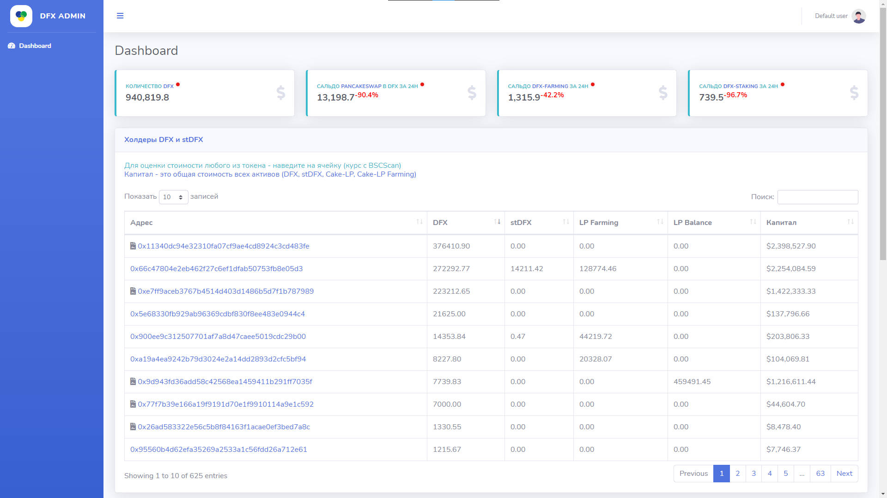
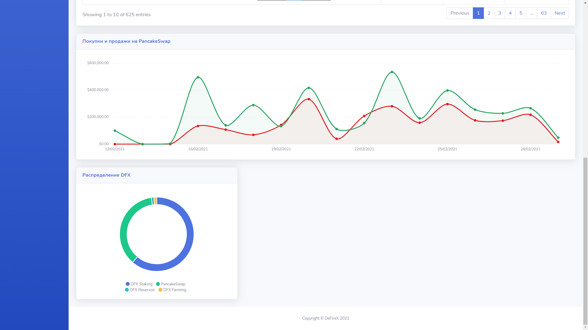

работает не корректно из за смены адресов: Смотрим здесь https://dfx-monitoring.herokuapp.com/index.html
# DFX-Monitoring
## Возможности
#### BackEnd
- Обширное API, с помощью которого можно получить еще больше информации, чем есть на данный момент (на фронтенде)
- API работает через BSCScan (предоставленный API и самописный парсер) и web3.js
- Самописная система кэширования данных, которая обрабатывает API (с настраиваемым временем кэширования и временем, через которое сработает Garbage Collector)

#### FrontEnd
- Отображение сколько DFXов на рынке
- Сальдо (разница между покупкой и продажей) DFXов на PancakeSwap (за сутки) + индикатор, который сравнивает изменение в процентах с прошлых суток
- Сальдо DFXов на контракте фарминга
- Сальдо DFXов на контракте стэкинга
- Таблица холдеров DFX и stDFX, где имеется адрес (с отображением - контрактом ли является адрес), баланс по DFX, stDFX, Cake-LP (в фарминге), Cake-LP (на балансе), а также общий капитал, который вычиляется со стоимости всех вышеупомянутых токенов (stDFX и Cake-LP конвертируем в DFX и умножаем на стоимость DFX), при наведении на любую из ячеек, где расположена информация о количестве токенов на балансе, можно узнать примерную капитализацию в долларах. В таблице реализована сортировка.
Балансы stDFX, Cake-LP (Farming), Cake-LP (Balance) подгружаются после загрузки страницы (для быстрого отображения таблицы).
- Покупки и продажи на PancakeSwap за последние 10000 транзакций. DFXы переводятся в доллары, суммируясь с BUSD
- Небольшой ПАЙевой график по распределению DFXов по четырем основным контрактам
- Четыре первых информационных блока обновляются примерно раз в 30 секунд (зависит от кэша и фронта, который запрашивает данные), о чем информирует красный индикатор

